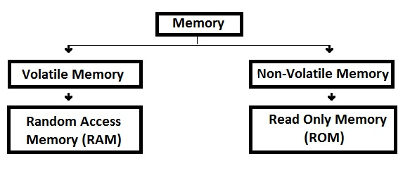

<!SLIDE title-slide>
.notes primeiro slide
# Gerência de Memória #
-----------------------
Prof. Rousseau L. Braga

FATEC rbraga@fatec-ro.br

<!SLIDE>
A Memória Principal
---
A memória principal é um componente fundamental em qualquer sistema de
computação. Ela constitui o “espaço de trabalho” do sistema, no qual são mantidos os processos, threads, bibliotecas compartilhadas e canais de comunicação, além do próprio núcleo do sistema operacional, com seu código e suas estruturas de dados.
<!SLIDE center>

>_"Uma gerência adequada da memória é essencial para o bom desempenho de um computador."_

<!SLIDE>
Estrutura de memória
---------------------

Existem diversos tipos de memória em um sistema de computação, cada um com
suas próprias características e particularidades, mas todos com um mesmo objetivo:
armazenar dados.

<!SLIDE bullets incremental transition=fade> 

Observando um sistema computacional típico, pode-se identificar
vários locais onde dados são armazenados:

+  registradores e o cache interno do processador (denominado cache L1)
+ o cache externo da placa-mãe (cache L2)
+ a memória principal (RAM)
<!SLIDE center smbullets incremental transition=fade> 
Além disso 

+ discos rígidos e unidades de armazenamento externas 
    - pendrives 
    - CD-ROMs 
    - DVD-ROMs 
    - fitas magnéticas 

também podem ser
considerados memória em um um sentido mais amplo, pois também têm como função
o armazenamento de dados.

<!SLIDE smbullets incremental>

Esses componentes de hardware são construídos usando diversas tecnologias e por
isso têm características distintas

+ capacidade de armazenamento
+ velocidade de operação
+ consumo de energia
+ custo por byte armazenado