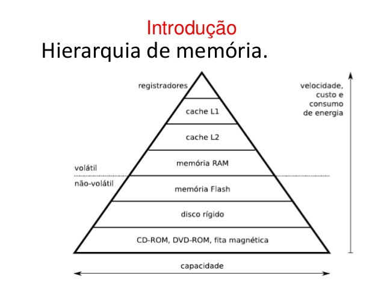

<!SLIDE title-slide>
.notes primeiro slide
# Gerência de Memória #
-----------------------
Prof. Rousseau L. Braga

FATEC rbraga@fatec-ro.br

<!SLIDE>
A Memória Principal
---
A memória principal é um componente fundamental em qualquer sistema de
computação. Ela constitui o “espaço de trabalho” do sistema, no qual são mantidos os processos, threads, bibliotecas compartilhadas e canais de comunicação, além do próprio núcleo do sistema operacional, com seu código e suas estruturas de dados.
<!SLIDE center>

>_"Uma gerência adequada da memória é essencial para o bom desempenho de um computador."_

<!SLIDE>
Estrutura de memória
---------------------

Existem diversos tipos de memória em um sistema de computação, cada um com
suas próprias características e particularidades, mas todos com um mesmo objetivo:
armazenar dados.

<!SLIDE bullets incremental transition=fade> 

Observando um sistema computacional típico, pode-se identificar
vários locais onde dados são armazenados:

+  registradores e o cache interno do processador (denominado cache L1)
+ o cache externo da placa-mãe (cache L2)
+ a memória principal (RAM)
<!SLIDE center smbullets incremental transition=fade> 
Além disso 

Além disso tem os discos rígidos e unidades de armazenamento externas citados abaixo:
 
    - pendrives 
    - CD-ROMs 
    - DVD-ROMs 
    - Discos SSD SSHD ou SAS
    - fitas magnéticas e etc...

também podem ser
considerados memória em um um sentido mais amplo, pois também têm como função
o armazenamento de dados.

<!SLIDE smbullets incremental>

Esses componentes de hardware são construídos usando diversas tecnologias e por
isso têm características distintas

+ capacidade de armazenamento
+ velocidade de operação
+ consumo de energia
+ custo por byte armazenado
<!SLIDE>

Essas características
permitem definir uma hierarquia de memória, representada na forma de uma pirâmide como a imagem logo abaixo:

<!SLIDE center>

Nessa pirâmide, observa-se que memórias mais rápidas, como os registradores da
CPU e os caches, são menores (têm menor capacidade de armazenamento), mais caras e
consomem mais energia que memórias mais lentas, como a memória principal (RAM) e
os discos rígidos.

<!SLIDE center>

Além disso, as memórias mais rápidas são voláteis, ou seja, perdem seu conteúdo ao ficarem sem energia.

Memórias que preservam seu conteúdo mesmo
quando não tiverem energia são denominadas não-voláteis.

<!SLIDE>
Tempo de Acesso 
--

O tempo de acesso caracteriza o tempo necessário para iniciar uma
transferência de dados de/para um determinado meio de armazenamento

<!SLIDE>
Taxa de Transferência
--

taxa de transferência indica quantos bytes por segundo podem ser lidos/escritos
naquele meio, uma vez iniciada a transferência de dados.

<!SLIDE smbullets center small>
Outra característica importante das memórias é a rapidez de seu funcionamento,
que pode ser detalhada em duas dimensões: 

    + tempo de acesso (ou latência) 
    + Taxa de transferência.

| Meio                 | Tempo de Acesso                                                                                          | Taxa de transferência            |
|----------------------|----------------------------------------------------------------------------------------------------------|----------------------------------|
| Cache L2             | 1ns                                                                                                      | 1GB/s (1 ns/byte)                |
| Memória RAM          | 60 ns                                                                                                    | 1GB/s (1 ns/byte)                |
| Memória flash (NAND) | 2 ms                                                                                                     | 10 MB/s (100 ns/byte)            |
| Disco rígido IDE     | 10 ms (tempo necessário para odeslocamento da cabeça de lei-tura e rotação do disco até o setordesejado) | 80 MB/s (12 ns/byte)             |
| DVD-ROM              | de 100 ms a vários minutos (casoa gaveta do leitor esteja aberta ouo disco não esteja no leitor)         | 10 MB/s (100 ns/byte) |
